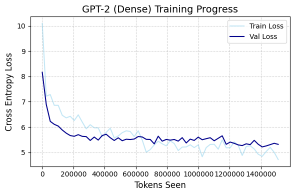
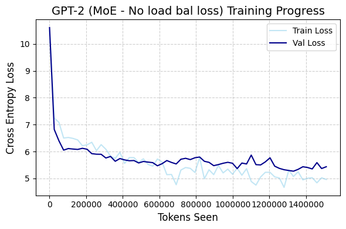
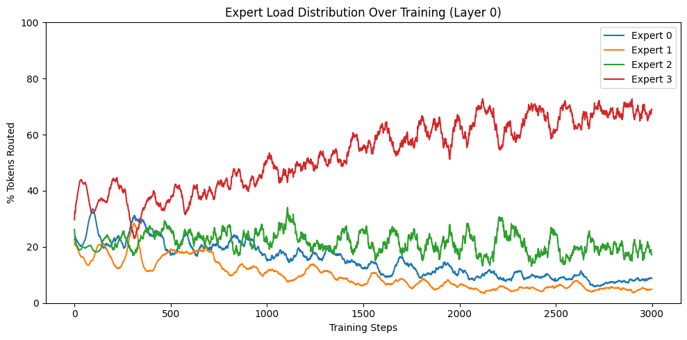
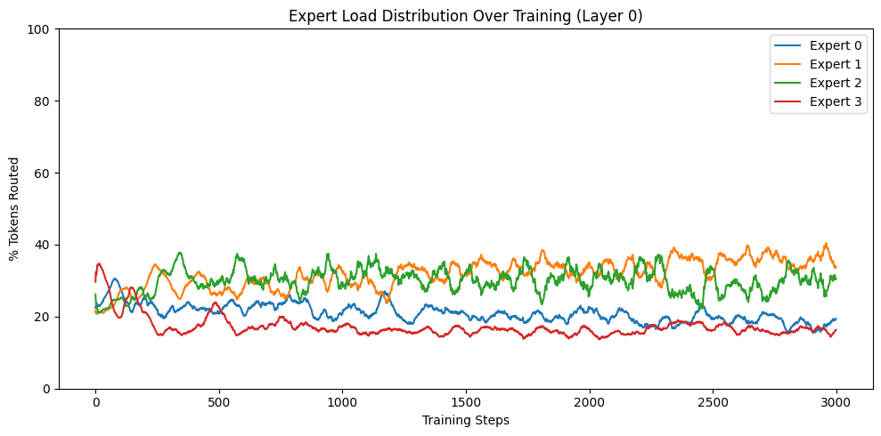
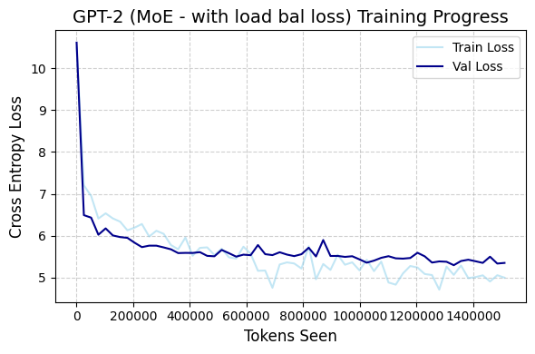
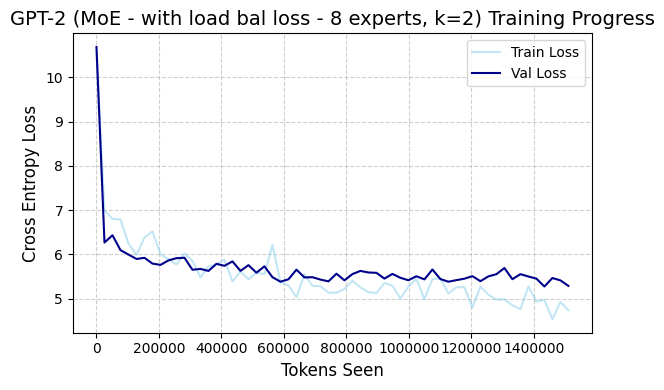
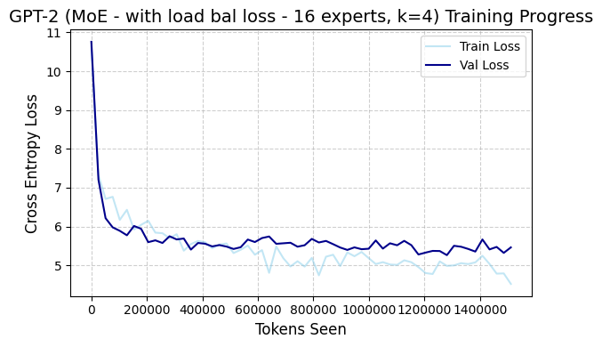
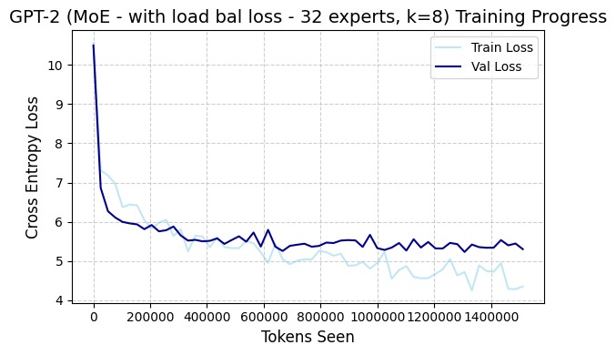
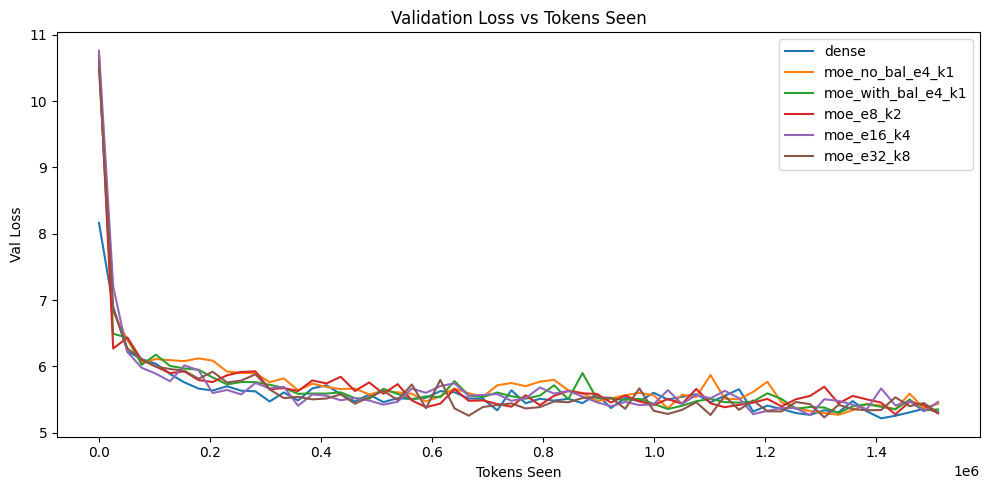
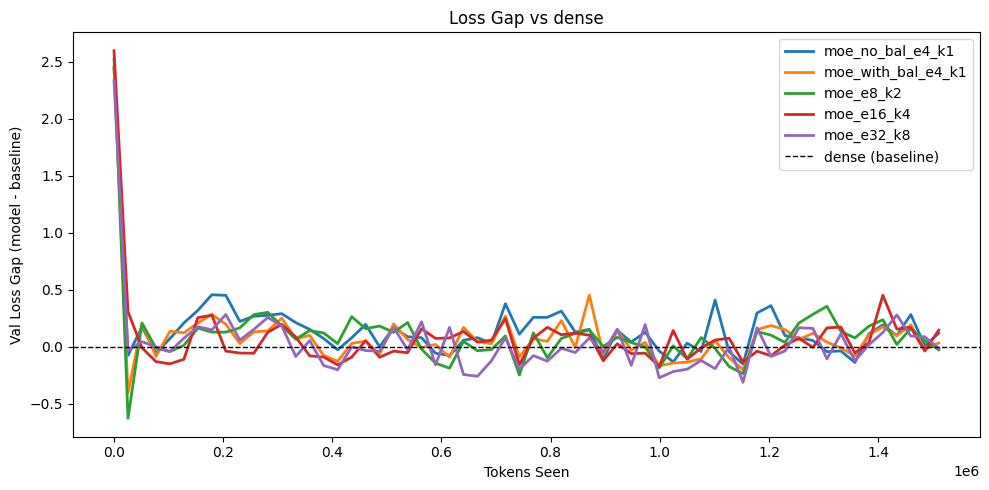

# **Mixture of Experts (MoE)**

Implemented MoE architecture for sparse network replacing dense feed forward network in GPT-2 style LLM. MoE brings sparsity by activating only a portion of the total parameters by routing each token to k experts (FFN) instead of all tokens activating all parameters like dense networks. This enables MoE to have much higher capacity than dense networks with same compute. Hence, MoE when implemented efficiently through parallelism, converges faster than its dense counterpart that has fewer parameters but same FLOPs.

Each token is routed to k experts through a router layer which outputs logits for each expert. Router is a single dense layer of shape (emb_size, number_of_experts). The logits are transformed into probabilities with softmax operation and then top-k experts are selected. The tokens are passed through selected experts which are FFN with hidden layer and the outputs of experts for that token are gated with router probabilities and added. At scale, the experts are put across GPUs, yielding faster and parallel execution. However, in this implementation of mine, I have implemented MoE sequentially, where each experts are ran in sequence. Training MoE is complicated because of non-differentiable topk routing decision, resulting into 1-2 experts primarily dominating where majority of the tokens are routed to these experts and other experts' weights are not trained. Therefore, I have also incorporated load balancing auxiliary loss to evenly route tokens across experts, so that no expert single-handedly dominate. This auxiliary loss penalizes experts based on the fraction of total tokens they receive, so more tokens routed to an expert will penalize that expert probability heavily. 

Usually, MoE arhcitectures like DeepSeekMOE have shared expert that is shared across all the tokens, however, in my implementation it is not employed. There's one more factor in expert variations, fine-grained ratio. Fine-grained ratio is the ratio of expert_hidden_dim to dense_hidden_dim. Having more number of experts with smaller fine-grained ration has found to be performing better in downstream tasks than the architecture having same number of parameters but less experts i.e. higher fine-grained ration value.

## **Experimentations**
In this implementation, I performed experimentation to test following hypothesis:
- With same number of active parameters MoE will converge the loss faster than its Dense counterpart
- MoE training with load balancing loss will result in uniform token routing across experts whereas without it few experts will highly dominate
- MoE with decreasing fine-grained ratio and increased number of experts (same total parameters) will lead to faster loss convergence (based on ablations in DeepSeekMOE paper about better performance of fine-grained experts in downstream tasks)

### **1. MoE vs Dense**

**Dense:**

Config:
- emb_size: 768
- hidden_dim: 768*4
- context_length:256,
- vocab_size:50257
- num_heads:12
- num_layers:12
- epochs: 2
- batch size: 2
- training tokens: 768464
- max sequence length: 256

 

**MoE:**

- emb_size: 768
- expert_hidden_dim: 768*4
- context_length:256,
- vocab_size:50257
- num_heads:12
- num_layers:12
- number of experts: 4
- number of shared experts: 0
- k: 1
- epochs: 2
- batch size: 2
- training tokens: 768464
- max sequence length: 256

Observation: In this experiment, MoE didn't converge faster than the dense model despite MoE having more total parameters in the form of experts. Both showed similar loss trends.

Explanation: Prior work showing faster convergence and advantage of MoE operates at very large regime in terms of model size as well dataset (billions-trillions of tokens). Here, small-dataset and model size might have affected or limited MoE to reach its potential through expert becoming specialized.

### **2. Routing With and Without Load Balancing Loss**

**MoE:**

- emb_size: 768
- expert_hidden_dim: 768*4
- context_length:256,
- vocab_size:50257
- num_heads:12
- num_layers:12
- number of experts: 4
- number of shared experts: 0
- k: 1
- epochs: 2
- batch size: 2
- training tokens: 768464
- max sequence length: 256

Following are the graphs for token distribution across experts during training (smoothed using window size of 50 for better interpretation):

Observation: As expected, training MoE with load balancing loss trains router better to uniformly route tokens to each expert than the one without the load balancing loss where expert 3 dominates. This is because the derivative of load balancing loss w.r.t. output probability from router is proportional to fraction of total tokens each expert receives and hence, higher expert usage -> higher grad -> stronger downweighting -> lowering probability for that expert.

### **3. Loss Convergence Across More Fine-Grained Experts**

**MoE 4 Experts:**

- emb_size: 768
- expert_hidden_dim: 768*4
- context_length:256,
- vocab_size:50257
- num_heads:12
- num_layers:12
- number of experts: 4
- number of shared experts: 0
- k: 1
- epochs: 2
- batch size: 2
- training tokens: 768464
- max sequence length: 256

 

**MoE 8 Experts Config:**

- emb_size: 768
- expert_hidden_dim: 768*2
- context_length:256,
- vocab_size:50257
- num_heads:12
- num_layers:12
- number of experts: 8
- number of shared experts: 0
- k: 2
- epochs: 2
- batch size: 2
- training tokens: 768464
- max sequence length: 256

 

**MoE 16 Experts Config:**

- emb_size: 768
- expert_hidden_dim: 768
- context_length:256,
- vocab_size:50257
- num_heads:12
- num_layers:12
- number of experts: 16
- number of shared experts: 0
- k: 4
- epochs: 2
- batch size: 2
- training tokens: 768464
- max sequence length: 256

 

**MoE 32 Experts Config:**

- emb_size: 768
- expert_hidden_dim: 768*(1/2)
- context_length:256,
- vocab_size:50257
- num_heads:12
- num_layers:12
- number of experts: 32
- number of shared experts: 0
- k: 8
- epochs: 2
- batch size: 2
- training tokens: 768464
- max sequence length: 256

 
 

**Following is comparison of the validation loss trends among different architectures:**

Observation: In this experiment, unlike improvement in performance on downstream tasks with more fine-grained experts, here all the expert configurations follow similar trend and more fine-grained experts didn't result in lower loss as compared to less fine-grained expert models. The plausible explanation could the scale of data on which current experiment was conducted, and hence, in order to empirically come to the conclusion whether fine-grained experts improve during pretraining faster similar to performance improvement on downstream tasks, this experiment should be conducted on large dataset (billions - trillions tokens).